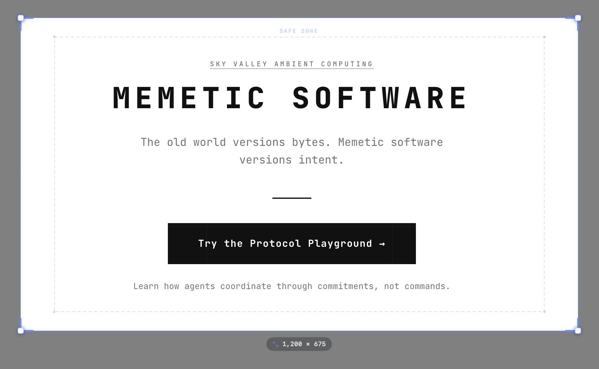

# SnipTease

A native macOS menu bar utility for framing screenshots for social media — one hotkey, every aspect ratio, with an MCP server built in so agents can grab screenshots too.



<!-- TODO: replace docs/screenshot.png with a real screenshot once the release build is published. -->

## What it is

SnipTease lives in your menu bar. Press **⌃⇧S** from anywhere, pick a preset, and capture a region that is already shaped for the platform you want to post to. No more cropping in Figma. No more "why is this cut off on LinkedIn."

- **Global hotkey** — `⌃⇧S` from any app.
- **Raycast-style mode picker** — start typing or hit **Tab** to switch between platform presets without touching the mouse.
- **Safe-zone guides** — optional overlay shows the platform's content-safe area so nothing important gets clipped.
- **Retina-correct export** — screenshots are captured at the display's native resolution, then Lanczos-downscaled to the target export size.
- **MCP server for agents** — run SnipTease in `--mcp` mode and your agent can take framed screenshots via JSON-RPC over stdio.
- **Native, tiny, no Electron** — pure Swift + SwiftUI, uses `ScreenCaptureKit`, `NSStatusItem`, and a minimal MCP stdio loop.

## Install

### Download the release (recommended)

1. Grab the latest `.dmg` from the [Releases page](https://github.com/noamt/sniptease/releases).
2. Open the `.dmg` and drag `SnipTease.app` to `/Applications`.
3. Launch it. The crop icon appears in your menu bar. Grant Screen Recording and Accessibility permissions when asked.

> Release builds are **signed and notarized** by Apple — they open without Gatekeeper warnings.

### Build from source

Requirements:

- macOS 14 (Sonoma) or later
- Xcode 15.4+

```sh
git clone https://github.com/noamt/sniptease.git
cd sniptease
open SnipTease.xcodeproj
```

Press **⌘R** in Xcode, or build from the command line:

```sh
xcodebuild -project SnipTease.xcodeproj \
           -scheme SnipTease \
           -configuration Release \
           CODE_SIGN_IDENTITY="" \
           CODE_SIGNING_REQUIRED=NO \
           CODE_SIGNING_ALLOWED=NO \
           build
```

The built app lands in `~/Library/Developer/Xcode/DerivedData/SnipTease-*/Build/Products/Release/SnipTease.app`.

## Usage

1. Click the crop icon in the menu bar (or press **⌃⇧S**).
2. Pick a preset — LinkedIn, X, Instagram, OG image, and friends.
3. Drag to select a region. The overlay shows the safe zone for the preset.
4. Release. The framed screenshot lands on your Desktop and in your clipboard, ready to paste.

## MCP server (for agents)

SnipTease doubles as a [Model Context Protocol](https://modelcontextprotocol.io/) server over stdio. Agents can take framed screenshots using natural-language descriptions of what to capture — SnipTease asks a vision-language model for the bounding box, then frames the result for your chosen preset.

### Configure your agent

Add SnipTease to your agent's MCP config (Claude Desktop, Cursor, etc.):

```json
{
  "mcpServers": {
    "sniptease": {
      "command": "/Applications/SnipTease.app/Contents/MacOS/SnipTease",
      "args": ["--mcp"],
      "env": {
        "GEMINI_API_KEY": "your-gemini-api-key-here"
      }
    }
  }
}
```

Get a free Gemini API key at [aistudio.google.com/apikey](https://aistudio.google.com/apikey).

### Tools exposed

- `list_presets` — returns the full preset catalog.
- `agent_capture` — takes a screenshot, asks the VLM where the described region is, frames it into the chosen preset, saves PNG + copies to clipboard.

Example prompt to your agent:

> "Capture the paragraph about authentication in the README for an Instagram portrait post."

## Presets

| ID | Name | Aspect | Export width | Safe margin |
|---|---|---|---|---|
| `og-standard` | OG Image | 1200:630 | 1200 px | 6% |
| `og-retina` | OG Image @2x | 1200:630 | 2400 px | 6% |
| `twitter-card` | X / Twitter Card | 2:1 | 1600 px | 6% |
| `linkedin-feed` | LinkedIn Feed | 1:1 | 1200 px | 8% |
| `linkedin-landscape` | LinkedIn Landscape | 1200:627 | 1200 px | 6% |
| `x-square` | X Square | 1:1 | 1080 px | 7% |
| `x-landscape` | X Landscape | 16:9 | 1200 px | 6% |
| `ig-square` | Instagram Square | 1:1 | 1080 px | 8% |
| `ig-portrait` | Instagram Portrait | 4:5 | 1080 px | 8% |
| `ig-story` | Instagram Story | 9:16 | 1080 px | 10% |

Presets live in [`SnipTease/PlatformPreset.swift`](SnipTease/PlatformPreset.swift) — adding one is a three-line change.

## License

MIT — see [LICENSE](LICENSE).
